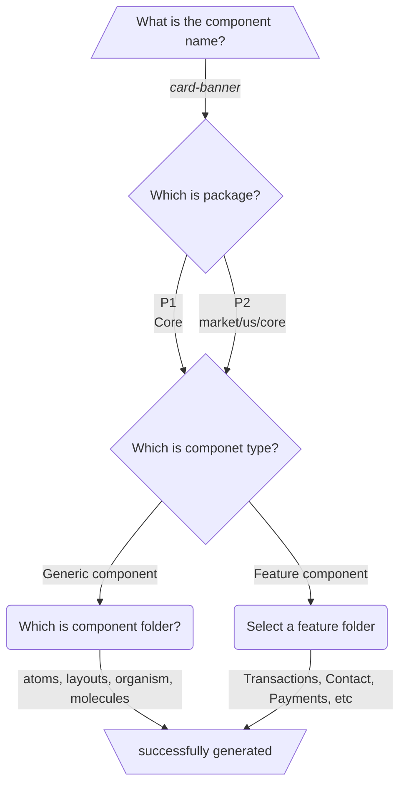

# Tekbnk Proof of Concept

Monorepo of the tekbnk proof of concept.
This monorepo is composed of three main parts: `Packages`, `Application` and `Docs`

## Packages

In packages are **P1** and **P2** as libraries.
The libraries are: `@tec-cyberbank-channels/lib-web-standard-module`, `@tec-cyberbank-channels/lib-web-standard-us-module`, `@tec-cyberbank-channels/lib-web-wellness-module`, `@tec-cyberbank-channels/lib-web-payments-us-module`.

**@tec-cyberbank-channels/lib-web-standard-module** is like **P1**, contains common components and functionality across all markets.
**@tec-cyberbank-channels/lib-web-standard-us-module**, **@tec-cyberbank-channels/lib-web-wellness-module**, **@tec-cyberbank-channels/lib-web-payments-us-module** are **P2** modules. They're specific modules for us market.

## Application

The application is an example of **P3**.
Has **P2** as dependency and contains all the customizations made by client.

## Docs

Contains the documentation about architecture, strategies, concept and examples of how it's built.
[Link](https://google.com)

# How to use

**First of all, install dependencies.**

```bash
yarn
```

**Then, build all workspaces.**

```bash
yarn build:all
```

**To start up**

```bash
yarn app start
```

#### Watch workspaces

If you're developing and want to watch some dependency projects, you could start these project.

#### @tec-cyberbank-channels/lib-web-standard-module

For example: If you want to watch @tec-cyberbank-channels/lib-web-standard-module, run this line

```bash
yarn core start
```

#### @tec-cyberbank-channels/lib-web-standard-us-module

To watch the Core us, run this

```bash
yarn core-us start
```

#### @tec-cyberbank-channels/lib-web-wellness-module

To watch the Digital wellness, run this

```bash
yarn wellness start
```

#### @tec-cyberbank-channels/lib-web-payments-us-module

To watch the paymevis module, run this

```bash
yarn payveris start
```

## <h1 style="color: #f39c12;">How to generate components quickly</h1>

#### Run this from <code>/web</code> path:

```bash
yarn generate
```

#### Follow this steps, according to your case:



;
